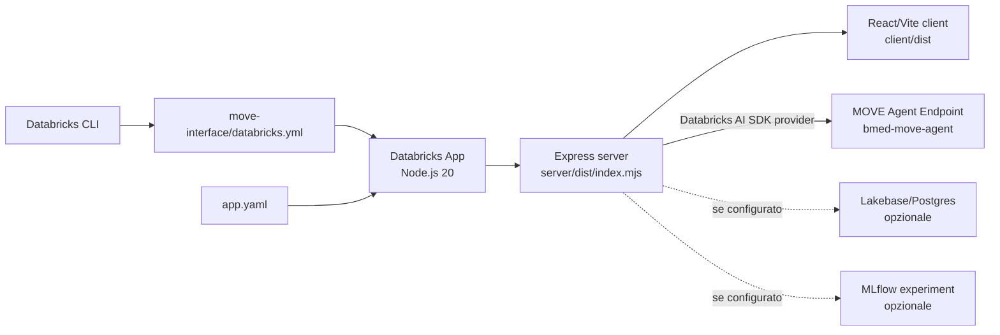
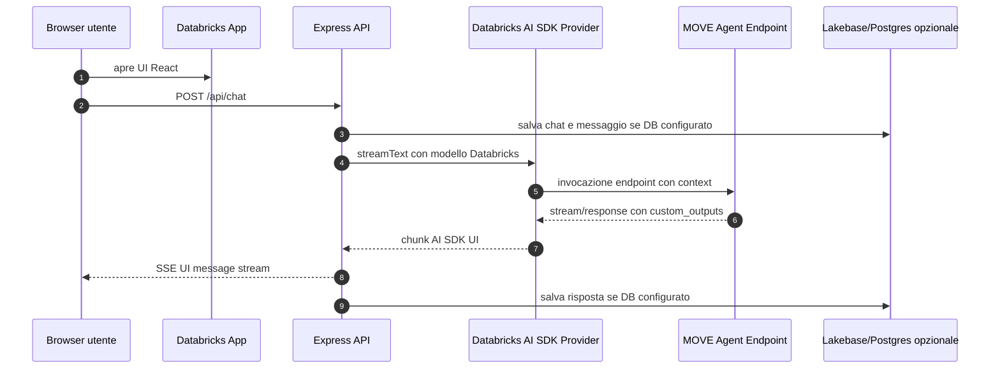

# Deploy MOVE Interface su Azure Databricks

Questa guida descrive il deploy di `move-interface` come **Databricks App** su Azure Databricks. L'app e' indipendente dall'agente: non importa codice Python da `move-agent`, ma chiama il Model Serving endpoint configurato.

Riferimenti ufficiali utili:

- [Databricks Apps su Azure Databricks](https://learn.microsoft.com/en-us/azure/databricks/dev-tools/databricks-apps/)
- [Databricks Asset Bundles su Azure Databricks](https://learn.microsoft.com/en-us/azure/databricks/dev-tools/bundles/)
- [Model Serving su Azure Databricks](https://learn.microsoft.com/en-us/azure/databricks/machine-learning/model-serving/)

## Assunzioni

- Databricks CLI e' installata e autenticata.
- Node.js 20 e npm sono disponibili localmente.
- L'agente MOVE e' gia' deployato come serving endpoint, di default `bmed-move-agent`.
- Il deploy viene eseguito dalla cartella `move-interface`.
- Il database Lakebase/Postgres e' opzionale. Senza database, l'app funziona in modalita' effimera: chat funzionante, cronologia non persistente.

## Risultato atteso

Alla fine esiste una Databricks App:

```text
bmed-move-interface-<suffix>
```

L'app riceve automaticamente:

```text
DATABRICKS_SERVING_ENDPOINT=<nome endpoint agente>
```

tramite il resource binding `serving-endpoint` definito in `databricks.yml` e `app.yaml`.

## Architettura deploy



## 1. Autenticazione CLI

```bash
databricks auth login --host "https://<workspace-id>.<region>.azuredatabricks.net"
databricks current-user me
```

Con profilo non default:

```bash
export DATABRICKS_CONFIG_PROFILE="<nome-profilo>"
```

## 2. Installare e buildare localmente

```bash
cd /Users/giacomo/dev/move/move-interface
npm install
npm run build
```

Il build esegue:

1. migrazioni database se la configurazione DB e' presente;
2. build React/Vite del client;
3. build Express/Node del server.

Se non ci sono variabili DB, la migrazione viene saltata e l'app resta in modalita' effimera.

## 3. Controllare `databricks.yml`

La configurazione principale e':

```yaml
bundle:
  name: bmed-move-interface

variables:
  serving_endpoint_name:
    default: "bmed-move-agent"

resources:
  apps:
    bmed_move_interface:
      name: bmed-move-interface-${var.resource_name_suffix}
      resources:
        - name: serving-endpoint
          serving_endpoint:
            name: ${var.serving_endpoint_name}
            permission: CAN_QUERY
```

Il valore `serving_endpoint_name` deve combaciare con l'endpoint creato da `move-agent`.

Per sovrascriverlo senza modificare file:

```bash
databricks bundle deploy -t prod --var serving_endpoint_name="<endpoint-agente>"
```

## 4. Controllare `app.yaml`

`app.yaml` definisce runtime e comando:

```yaml
command: ["npm", "run", "start"]
runtime: nodejs20

env:
  - name: DATABRICKS_SERVING_ENDPOINT
    valueFrom: serving-endpoint
```

`valueFrom: serving-endpoint` collega la variabile d'ambiente al resource binding Databricks. L'app non deve contenere token o nomi endpoint hardcoded nel codice.

## 5. Validare il bundle

```bash
databricks bundle validate -t prod \
  --var serving_endpoint_name="bmed-move-agent"
```

Per ambiente dev:

```bash
databricks bundle validate -t dev \
  --var serving_endpoint_name="bmed-move-agent"
```

## 6. Deploy dell'app

```bash
databricks bundle deploy -t prod \
  --var serving_endpoint_name="bmed-move-agent"
```

Poi avviare o aggiornare l'app:

```bash
databricks bundle run bmed_move_interface -t prod \
  --var serving_endpoint_name="bmed-move-agent"
```

Script equivalente:

```bash
./scripts/deploy.sh prod
```

Lo script usa `DATABRICKS_SERVING_ENDPOINT` se presente, altrimenti `bmed-move-agent`.

## 7. Verificare la URL

```bash
databricks bundle summary -t prod
```

La summary mostra il nome della Databricks App e il link nel workspace.

## 8. Flusso runtime della chat



## 9. Modalita' database

### Modalita' effimera

Nessuna configurazione richiesta. Se mancano `PGDATABASE`/`PGHOST` o `POSTGRES_URL`, l'app:

- risponde normalmente;
- non persiste cronologia;
- mostra stato effimero nell'interfaccia.

### Modalita' persistente

Per abilitare cronologia persistente:

1. decommentare in `databricks.yml` la risorsa `database_instances.chatbot_lakebase`;
2. decommentare il resource binding `database` dentro `apps.bmed_move_interface.resources`;
3. deployare nuovamente il bundle;
4. eseguire le migrazioni se necessario.

La connessione viene letta da:

- `POSTGRES_URL`, oppure
- `PGHOST`, `PGDATABASE`, `PGPORT`, `PGSSLMODE`, con token Databricks recuperato dal modulo auth.

## 10. Feedback MLflow opzionale

Il feedback thumbs up/down richiede:

- database persistente abilitato;
- resource binding `experiment` in `databricks.yml`;
- variabile `MLFLOW_EXPERIMENT_ID` in `app.yaml` con `valueFrom: experiment`.

Per trovare l'esperimento associato all'endpoint:

```bash
npx tsx scripts/get-experiment-id.ts --endpoint bmed-move-agent
```

Poi aggiornare il blocco opzionale in `databricks.yml` e decommentare in `app.yaml`:

```yaml
- name: MLFLOW_EXPERIMENT_ID
  valueFrom: experiment
```

## 11. Permessi richiesti

L'identita' che deploya deve poter:

- creare/aggiornare Databricks Apps;
- leggere il serving endpoint dell'agente;
- assegnare `CAN_QUERY` all'app sul serving endpoint;
- creare Lakebase/Postgres se si abilita la persistenza;
- assegnare permessi sull'esperimento MLflow se si abilita feedback.

L'app service principal deve avere:

- `CAN_QUERY` sul serving endpoint MOVE;
- `CAN_CONNECT_AND_CREATE` sul database, solo se persistenza e' abilitata;
- `CAN_EDIT` sull'esperimento, solo se feedback e' abilitato.

## 12. Smoke test

Dopo il deploy:

1. aprire l'URL della Databricks App;
2. inviare `Ciao, chi sei?`;
3. verificare che la risposta arrivi dall'agente MOVE;
4. inviare una domanda dati, per esempio `Mostrami il portafoglio dell'agente`;
5. verificare che la UI mostri eventuali renderable/card e non testo grezzo `[CARD:...]`.

## Problemi comuni

### `Please set the DATABRICKS_SERVING_ENDPOINT`

Il resource binding non e' stato applicato o `app.yaml` non e' stato letto. Controllare:

- nome risorsa `serving-endpoint` in `databricks.yml`;
- `valueFrom: serving-endpoint` in `app.yaml`;
- comando `databricks bundle run bmed_move_interface`.

### 403 o permesso negato sul serving endpoint

Controllare che l'app abbia `CAN_QUERY` sull'endpoint:

```bash
databricks serving-endpoints get-permissions bmed-move-agent
```

Rieseguire:

```bash
databricks bundle deploy -t prod --var serving_endpoint_name="bmed-move-agent"
databricks bundle run bmed_move_interface -t prod --var serving_endpoint_name="bmed-move-agent"
```

### Build fallisce su database

Se non vuoi persistenza, rimuovi variabili `PG*` parziali dall'ambiente. Con nessuna configurazione DB, `npm run build` salta le migrazioni.

Se vuoi persistenza, assicurati che `PGHOST`, `PGDATABASE` e auth Databricks siano coerenti con la Lakebase instance.

### La UI carica ma la chat non risponde

Controllare log della Databricks App e del serving endpoint:

- endpoint agente pronto;
- endpoint name corretto;
- app service principal con `CAN_QUERY`;
- eventuale OBO configurato correttamente se l'endpoint lo richiede;
- payload endpoint compatibile con `agent/v1/responses` o `agent/v2/responses`.

